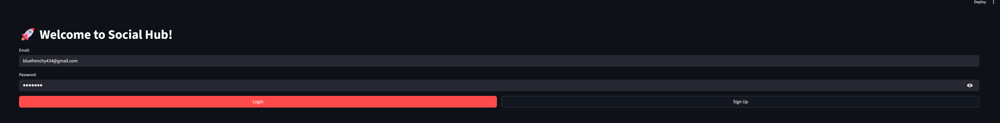
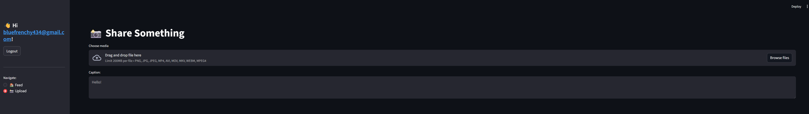

# SocialHub
Sharing photo and video app.

# Tools Used:
- Use FastAPI: fast application programmable interface.
- ImageKit: provides powerful tools for managing images and videos.
- SqlAlchemy: to manage the database information.
- Uvicorn: is a web server in python that allows us to serve our fastapi application.
- Backend Server: handles all data operations creating, reading, updating and deleting  data (CRUD app)

# Fill Out Login Info:

# Welcome and Navigation Tab:

# Feed Screen:

# Upload Screen:

